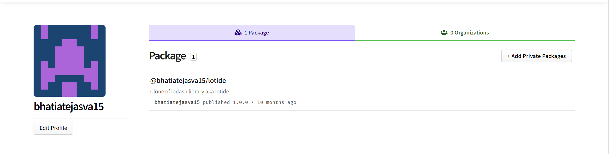

# Lotide

A mini clone of the [Lodash](https://lodash.com) library, created to deepen my understanding of utility libraries. This project includes essential functions for array and object manipulation, string analysis, and more, demonstrating proficiency in JavaScript and functional programming. It is designed for educational purposes and showcases custom implementations of common Lodash functionalities.

## Purpose

**_BEWARE:_ This library was published for learning purposes. It is _not_ intended for use in production-grade software.**

This project was created and published by me as part of my learnings at Lighthouse Labs. 

## Usage

**Install it:**

`npm install @bhatiatejasva15/lotide`

**Require it:**

`const _ = require('@bhatiatejasva15/lotide');`

**Call it:**

`const results = _.tail([1, 2, 3]) // => [2, 3]`

## Published Library

## Documentation

The following functions are currently implemented:

* **`assertArraysEqual(array1, array2)`**: Compares two arrays and prints whether they are equal. It uses the `eqArrays` function to perform the comparison.
* **`assertEqual(actual, expected)`**: Compares two primitive values and prints whether they are equal.
* **`eqArrays(arr1, arr2)`**: Takes in two arrays and returns true if they are equal, and false otherwise. Equality is determined by checking both the length of the arrays and the value at each corresponding index.
* **`eqObjects(object1, object2)`**: Compares two objects and returns true if they are equal, and false otherwise. It handles nested arrays using the `eqArrays` function.
* **`assertObjectsEqual(actual, expected)`**: Compares two objects and prints whether they are equal. It uses `eqObjects` to perform the comparison and utilizes `util.inspect` for better object inspection in the output.
* **`countLetters(inputString)`**: Takes a string and returns an object where the keys are the characters, and the values are the count of each character in the string.
* **`countOnly(allItems, itemsToCount)`**: Takes an array of strings and an object specifying which items to count. Returns an object with counts for the specified items.
* **`findKey(object, callback)`**: Scans an object and returns the first key for which the callback returns a truthy value. If no key is found, it returns undefined.
* **`findKeyByValue(inputObject, value)`**: Returns the first key in an object that corresponds to a given value. If no key is found, it returns undefined.
* **`head(arr)`**: Returns the first element of an array.
* **`tail(arr)`**: Returns a new array containing all elements except the first.
* **`middle(array)`**: Returns an array containing the middle element(s) of the input array. If the array has one or two elements, it returns an empty array.
* **`letterPositions(sentence)`**: Returns an object where each key is a letter in the string and the value is an array of indices where that letter appears.
* **`map(array, callback)`**: Creates a new array populated with the results of calling a provided function on every element in the calling array.
* **`takeUntil(array, callback)`**: Returns a slice of the array with elements taken from the beginning until the callback returns a truthy value.
* **`without(source, itemsToRemove)`**: Returns a new array that excludes the specified items from the source array.
